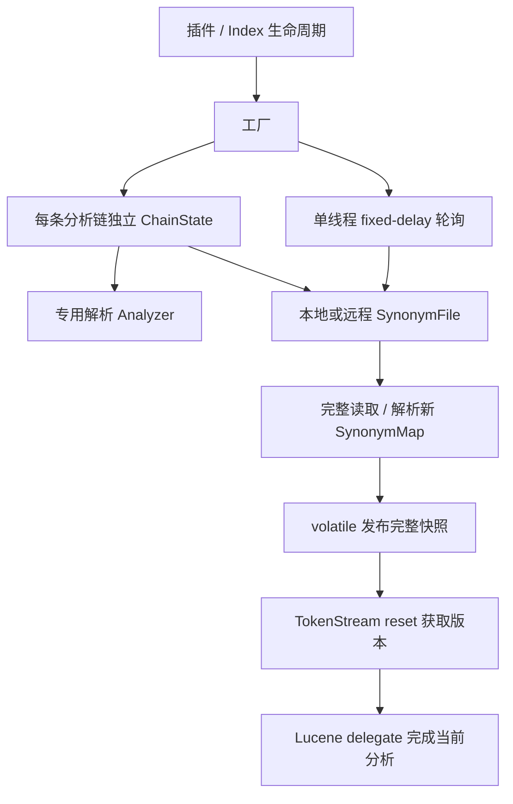

# 架构与行为

当前实现针对 ES 8.7.1。原生替代方案见 [版本与定位](ELASTICSEARCH_SUPPORT.md)，测试命令见 [开发指南](DEVELOPMENT.md)，变更证据见 [项目审查](PROJECT_REVIEW.md)。

## 组件边界

| 组件 | 职责 |
| --- | --- |
| `DynamicSynonymPlugin` | 注册两种 filter，按 ES Index 跟踪工厂，索引移除/插件关闭时释放资源 |
| `DynamicSynonymTokenFilterFactory` | 读取配置，按分析链创建独立解析 Analyzer、词库源和快照；调度轮询 |
| `DynamicSynonymGraphTokenFilterFactory` | 复用基础工厂，只改变 TokenStream 类型 |
| `SynonymFile` / 两个实现 | 检查源版本，读取完整词库，成功解析后提交版本标记 |
| `SynonymRuleParser` | 复用 Elasticsearch 的 Solr/WordNet parser |
| `AbsSynonymFilter` | 在 `reset()` 时取快照，管理一次分析周期的 delegate 生命周期 |
| `DynamicSynonymFilter` / `DynamicSynonymGraphFilter` | 委托宿主 Lucene 的 `SynonymFilter` / `SynonymGraphFilter` 算法 |

## 热更新一致性

初始化在工厂锁内执行，失败立即释放 source/Analyzer；未建立任何链的工厂关闭并从插件登记移除。只有初始加载成功后才启动定时任务。每条分析链使用自身 tokenizer、char filters 和前置 filters 的 `getSynonymFilter()`，不复用其他分析链的解析状态。

每个工厂只有一个 daemon executor，以 `scheduleWithFixedDelay` 串行检查各链，避免慢请求结束后追赶积压轮询。链内加载与关闭协调；读取或解析失败不替换现有 map。轮询错误日志只记录 filter 名和异常类型，避免打印规则或带凭据的 URL。

新 map 通过 `volatile` 发布，不枚举或改写活跃过滤器。过滤器在 `reset()` 读取当前 map，在同一次 TokenStream 周期的 `incrementToken()` / `end()` 中保持该版本。下一次 reset 使用新版本；Lucene Analyzer 的 TokenStream 复用仍能感知更新。

空词库是成功加载的一种状态：delegate 直接使用输入流，但 wrapper 始终存在，因此空→非空→空都可更新。旧 delegate 与新 delegate 共享 input/attributes；更换时不能关闭旧 delegate，否则会提前关闭输入；最终 `close()` 关闭当前链。

两个特化工厂统一返回 identity `getSynonymFilter()`，构建后续同义词规则时不会把前一个同义词 filter 的堆叠输出带入 parser。Graph 多词路径保留位置长度；用于索引时仍需考虑 `flatten_graph`，推荐用于搜索分析。

## 配置

| 配置 | 默认值 | 含义 |
| --- | --- | --- |
| `type` | 必填 | `dynamic_synonym` 或 `dynamic_synonym_graph` |
| `synonyms_path` | 必填，非空白 | HTTP(S) URL，或可访问的本地路径 |
| `interval` | `60` | 正整数秒；每轮结束后等待的时间，非正数在构造时拒绝 |
| `ignore_case` | `false` | 匹配输入时忽略大小写；规则规范化仍受解析分析链影响 |
| `expand` | `true` | parser 的等价规则展开选项 |
| `lenient` | `false` | 宽容解析选项；不代表吞掉网络错误 |
| `format` | 空字符串 | `wordnet`（不区分大小写）使用 WordNet，其他值使用 Solr parser |
| `updateable` | `false` | true 返回 `SEARCH_TIME`，false 返回 `ALL`；两者都轮询 |

## 源版本与失败处理

本地路径使用 `env.configFile().resolve(location)`。相对路径基于 ES config 目录，绝对路径受宿主文件权限约束，无工作目录/classpath 回退。UTF-8 读取；比较修改时间、长度及 file key，因此时间回退和原子替换也能触发更新。读取前后版本标记不一致时丢弃本次加载，下轮重试。只有解析成功后提交标记；删除/读取失败保留旧 map，恢复后重试。同一文件原地改写且修改时间与长度均不变的情况不保证检测，发布词库应更新 mtime 或使用原子替换。

远程首次直接 GET。之后 HEAD 带上一次成功 GET 的 ETag/Last-Modified：304 不更新；200 且标记变化或两个头都缺失则 GET；405/501 回退本轮 GET；其他状态视为检查失败。HEAD 标记不提前提交。

GET 仅接受 200，按标准 Content-Type charset 解析，未声明则 UTF-8。空内容是有效空词库；HTTP 错误、断连、超时、非法规则均不再伪装为空词库或 `1=>1`。失败后下轮继续 GET，即使校验头没有再次变化。成功读取并解析完整响应后，提交该 GET 的版本标记。

HTTP 显式设置 10 秒建连/连接池获取超时、HEAD 最长 15 秒响应超时、GET 60 秒响应超时。HttpClient 对可重试请求最多额外尝试一次，忽略任意长的 Retry-After 等待；这些是连接/响应阶段限制，不是整个词库传输的绝对总耗时上限。

## 资源生命周期

工厂关闭时先停止后续调度、标记链关闭并关闭 source（远程 client close 中断在途 HTTP），再等待该链加载临界区结束并关闭解析 Analyzer。已关闭链不会发布新 map。关闭可重复调用；插件监听 `afterIndexRemoved`，清理删除、关闭或移除索引对应的工厂；插件退出作最终兜底。

同一工厂的不同链分别持有 map/source/Analyzer；运行期间若反复新建分析链，状态保留至工厂随索引移除关闭。未实现跨节点原子更新或自动清理 ES request cache。热更新不重写已索引文档。

## 交付

POM 版本驱动插件、ES、analysis-common、cluster-runner 版本。Java 使用 `--release 17`。assembly 将描述符、策略、LICENSE/NOTICE、项目及必要依赖 JAR 放入 ZIP 根目录，不打包宿主 ES/Lucene/Log4j 或测试 JAR。

本地 `Dockerfile` 以 JDK 17 执行完整 Maven 测试，运行镜像固定 ES 8.7.1。Actions 的 Maven job 生成并检查 ZIP；后续容器 smoke 和标签发布均下载同一份 ZIP，再由 `Dockerfile.package` 安装到 ES 8.7.1 镜像。标签版本先与 POM 匹配，并在全部验证通过后推送明确版本的镜像、附加 ZIP 到 GitHub Release。
